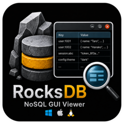
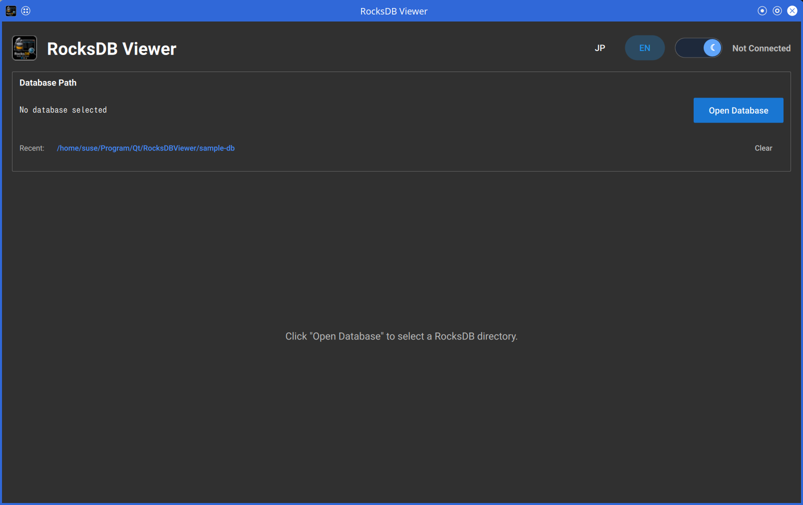
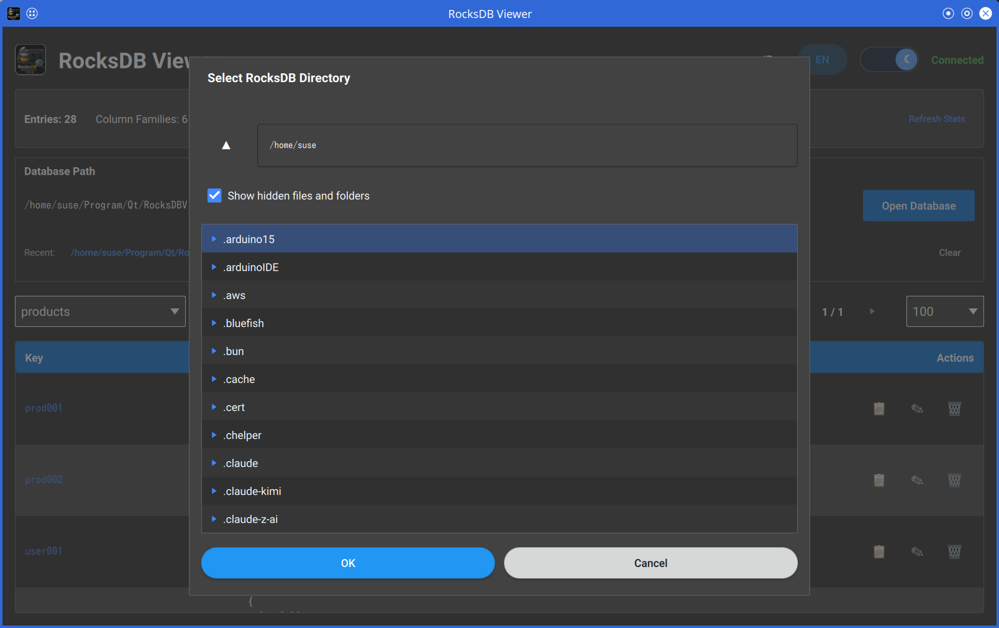
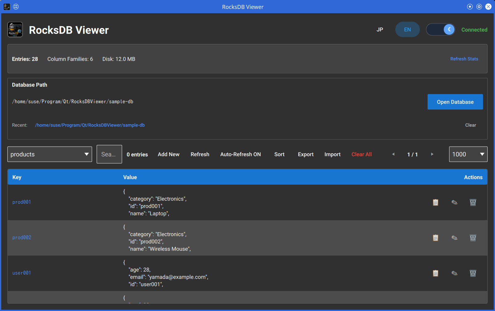
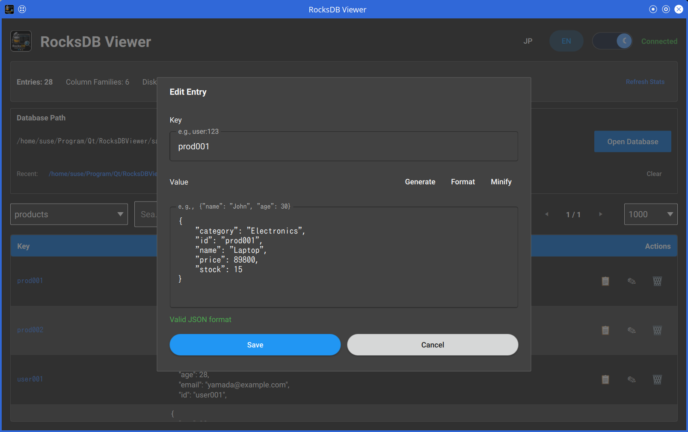

# RocksDB Viewer (Qt/QML Edition)

A desktop GUI application for browsing and editing RocksDB databases,  
built with **Qt 6.9 Quick (QML)** and **C++20**.  

This is a native reimplementation of the original Python/pywebview/HTML-based RocksDBViewer,  
offering the same feature set with native performance and no browser/WebView dependency.  


<p align="center">
  
  
</p>

## Screenshots

| Main Window | Select Database |
|:---:|:---:|
|  |  |
| **Database View** | **Edit Entry** |
|  |  |

## Requirements

- **Qt** 6.9 or later (tested with 6.9.1)
- **RocksDB** C++ library and headers (tested with 11.1.1)
- **CMake** 3.16 or later
- **C++ Compiler** with C++20 support (GCC 11+, Clang 14+, MSVC 2019+)

> **RocksDB requirement:**  
> The current CMake configuration does not search system paths for RocksDB automatically.  
> Set `ROCKSDB_ROOT` to a RocksDB installation or source-build directory that contains  
> `include/rocksdb/db.h` and either `lib/librocksdb.*` or `lib64/librocksdb.*`.  

## Build

### 1. Prepare RocksDB

Install RocksDB with your package manager when it is available, and set `ROCKSDB_ROOT` to that installation prefix.  

Example dependency installation commands:

#### RocksDB build dependencies

**RHEL**  

```bash
sudo dnf groupinstall "Development Tools"
sudo dnf install cmake git \
    snappy-devel zlib-devel bzip2-devel lz4-devel libzstd-devel gflags-devel
```

**SUSE**  

```bash
sudo zypper install -t pattern devel_basis
sudo zypper install cmake git \
    snappy-devel zlib-devel libbz2-devel liblz4-devel libzstd-devel gflags-devel
```

#### RocksDB Viewer build dependencies

**RHEL**  

```bash
sudo dnf groupinstall "Development Tools"
sudo dnf install cmake git \
    qt6-qtbase-devel qt6-qtdeclarative-devel qt6-qtquickcontrols2-devel qt6-linguist \
    rocksdb-devel
```

**SUSE**  

```bash
sudo zypper install -t pattern devel_basis
sudo zypper install cmake git \
    qt6-core-devel qt6-gui-devel qt6-quick-devel qt6-quickcontrols2-devel qt6-linguist-devel \
    rocksdb-devel
```

> **Note:**  
> If your distribution does not provide a suitable RocksDB package, follow the source-build instructions below.  
> If the distribution Qt packages do not satisfy the required Qt 6.9 or later,  
> install Qt 6.9 separately for your environment.  

If your package manager does not provide RocksDB,  
build it from source by following the official repository and install guide:  

- https://github.com/facebook/rocksdb
- https://github.com/facebook/rocksdb/blob/main/INSTALL.md

Example source build:  

```bash
git clone https://github.com/facebook/rocksdb.git
cd rocksdb
make shared_lib
# or: make static_lib
```

### 2. Configure

```bash
mkdir build && cd build

cmake .. -DROCKSDB_ROOT=/path/to/rocksdb \
         -DCMAKE_BUILD_TYPE=Release

# Or cmake with Qt path
cmake .. -DROCKSDB_ROOT=/path/to/rocksdb \
         -DCMAKE_PREFIX_PATH=/path/to/qt/6.9.1/gcc_64 \
         -DCMAKE_BUILD_TYPE=Release
```

### 3. Build

```bash
cmake --build . -j$(nproc)
```

## Run

```bash
# Launch without database
./RocksDBViewer

# Launch with a specific database path
./RocksDBViewer /path/to/your/rocksdb
```

> **Note:**  
> If the RocksDB shared library is not in the system library path,  
> set `LD_LIBRARY_PATH` to the RocksDB `lib` or `lib64` directory under `ROCKSDB_ROOT`:  

```bash
export LD_LIBRARY_PATH=/path/to/rocksdb/lib:$LD_LIBRARY_PATH
# or: export LD_LIBRARY_PATH=/path/to/rocksdb/lib64:$LD_LIBRARY_PATH
./RocksDBViewer
```

## Features

- **Native desktop GUI** — No browser or HTTP server required
- **Direct RocksDB access** — Uses the official RocksDB C++ API
- **Column Family support** — Browse and switch between multiple column families
- **CRUD operations** — Add, edit, delete, and clear all entries
- **Real-time search** — Filter entries by key or value content
- **Prefix search** — Quickly find keys starting with a specific string
- **Pagination** — Browse large datasets with configurable page sizes
- **Sort** — Toggle between original, ascending, and descending order
- **Database statistics** — Live display of entry counts, column families, and disk usage
- **JSON helpers** — Format, minify, validate, and generate skeleton templates in the editor
- **Import / Export** — JSON file I/O
- **Auto-refresh** — Optional 10-second interval polling
- **Recent databases** — Quick access to previously opened paths (up to 10)
- **Custom file picker** — Folder and file selection dialog with keyboard navigation
- **Internationalization** — Japanese / English language switch with persistent preference
- **Theme switch** — Light / Dark mode with persistent preference
- **Window state persistence** — Remembers size, position, and display preferences
- **Settings migration** — Automatic migration from legacy storage format
- **Keyboard shortcuts** — Quick access via keyboard for common actions

## Keyboard Shortcuts

| Shortcut | Action |
|----------|--------|
| Ctrl+O | Open database |
| Ctrl+R | Refresh data |
| Ctrl+N | Add new entry |
| Ctrl+F | Focus search field |
| Ctrl+T | Toggle theme |
| Ctrl+Q | Quit application |

## Project Structure

```
RocksDBViewer/
├── CMakeLists.txt
├── README.md
├── README_JP.md
├── LICENSE
├── RocksDBViewer.desktop.in         # Linux desktop entry template
├── assets/
│   ├── RocksDBViewer@128.png
│   ├── RocksDBViewer@256.png
│   ├── RocksDBViewer@512.png
│   └── Qt.png
├── i18n/
│   ├── rocksdbviewer_ja.ts          # Japanese translations
│   └── rocksdbviewer_en.ts          # English source strings
├── licenses/                        # Third-party license texts
├── qml/
│   ├── main.qml                     # Main application window
│   ├── Theme.qml                    # Theme constants
│   └── components/
│       ├── HeaderBar.qml
│       ├── DatabasePanel.qml
│       ├── ControlBar.qml
│       ├── DataTable.qml
│       ├── EditModal.qml
│       ├── ToastManager.qml
│       ├── WelcomePage.qml
│       ├── StatsPanel.qml
│       ├── SkeletonMenu.qml
│       └── FilePickerDialog.qml
├── sample-db/                       # Sample RocksDB data for local testing
├── screenshot/
│   ├── main.png
│   ├── select_db.png
│   ├── read_db.png
│   └── edit_db.png
├── src/
│   ├── main.cpp                     # Application entry point and QML bootstrapping
│   ├── backend/
│   │   ├── RocksDBBackend.h/.cpp    # RocksDB access, CRUD, import/export
│   │   ├── EntryModel.h/.cpp        # QAbstractListModel for entry data
│   │   └── FilterProxyModel.h/.cpp  # Search, sort, and pagination proxy
│   └── utils/
│       ├── JsonUtils.h/.cpp         # JSON formatting, minify, validate, skeleton helpers
│       ├── I18nManager.h/.cpp       # Runtime language switching
│       ├── FileSystemModel.h/.cpp   # File system model for custom picker dialogs
│       ├── SettingsMigration.h/.cpp # Settings storage migration helpers
│       └── SettingsKeys.h           # Persistent settings key constants
└── tools/
    └── create_sample_db.cpp         # Sample database generator
```

## Updating Translations

After modifying source strings in `.cpp` or `.qml` files:

```bash
# Extract strings
lupdate src qml -ts i18n/rocksdbviewer_ja.ts i18n/rocksdbviewer_en.ts

# Edit .ts files (e.g., with Qt Linguist or text editor)

# Generate .qm files
lrelease i18n/rocksdbviewer_ja.ts i18n/rocksdbviewer_en.ts
```

## License

This project is licensed under the [MIT License](LICENSE).  

Third-party licenses:  
- [RocksDB](https://github.com/facebook/rocksdb) is licensed under the [Apache License, Version 2.0](https://github.com/facebook/rocksdb/blob/main/LICENSE.Apache)  
  and includes code under the [BSD 3-Clause License](https://github.com/facebook/rocksdb/blob/main/LICENSE.leveldb). See the `licenses/` directory for copies.  
- [Qt](https://www.qt.io/) is licensed under the [LGPL v3](https://www.gnu.org/licenses/lgpl-3.0.html).
