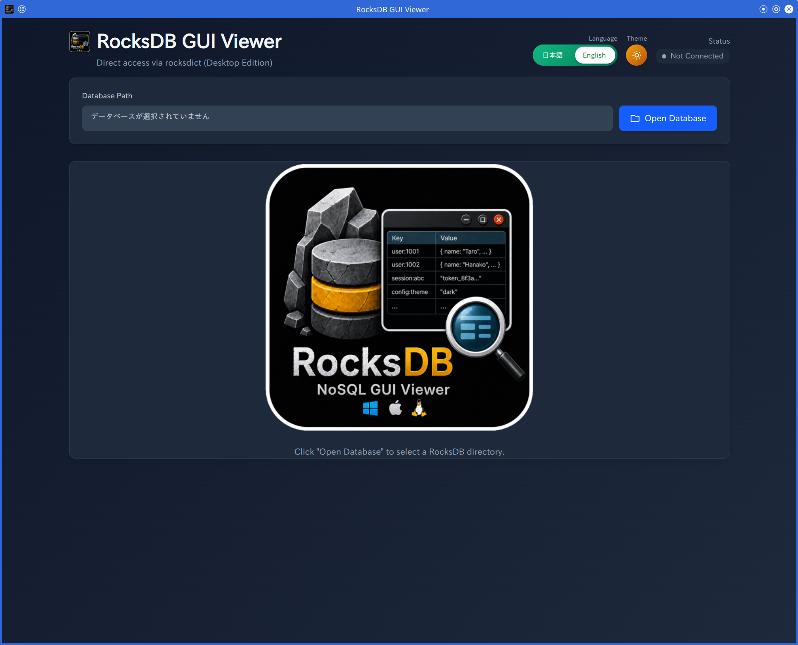
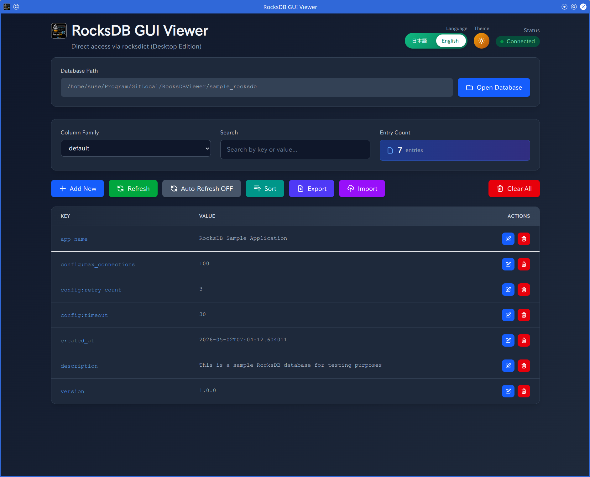
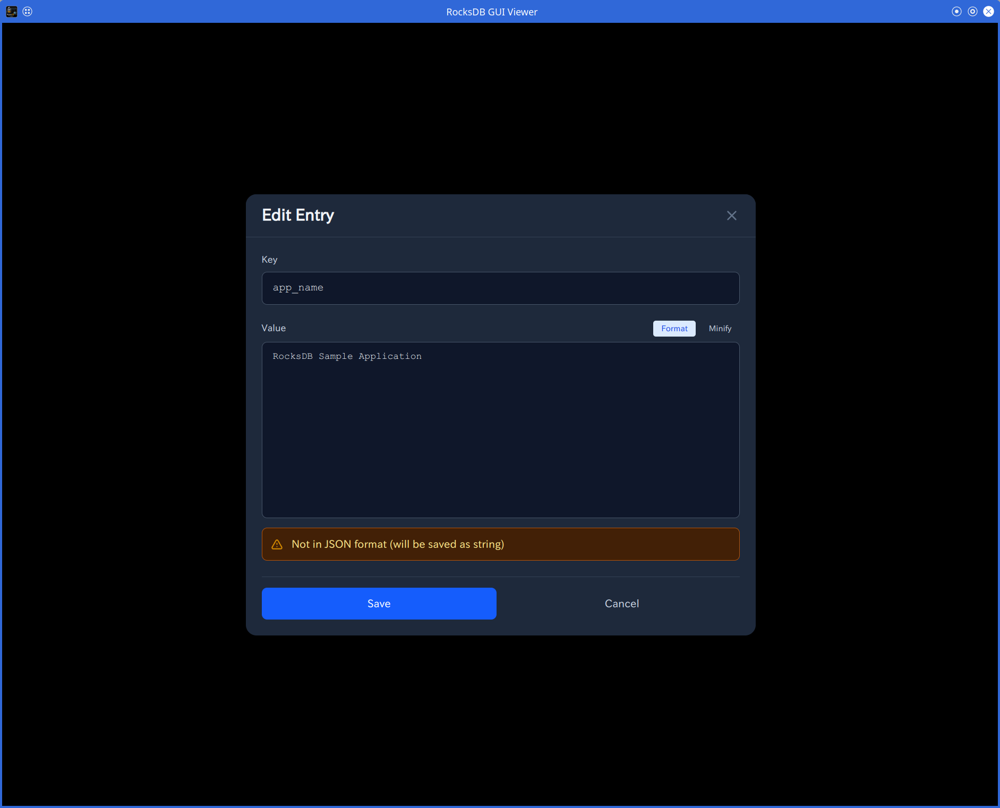

# RocksDB GUI Viewer

A desktop GUI tool for browsing and editing RocksDB databases. Powered by [pywebview](https://pywebview.flowrl.com/) and [rocksdict](https://congyuwang.github.io/RocksDict/), it runs as a single native window without requiring a browser, HTTP server, or open port.

## Screenshots

### Welcome screen

When launched without a database, the app shows a welcome screen — click **Open Database** to pick a RocksDB directory through the native folder dialog.



### Main view

Once a database is open, every column family is listed in the dropdown. Browse, filter, sort, edit, import, and export data straight from the table.



### Edit entry

The modal editor lets you add or edit a key/value pair with format / minify helpers and real-time JSON validation.



## Overview

This tool consists of the following components:

1. **RocksDBViewer.py** — Desktop entry point (pywebview + rocksdict)
2. **Create_RocksDB.py** — Sample database creation script (for initial setup)
3. **RocksDBViewer.html** — Web UI rendered inside the native window
4. **js/rocksdb-manager.js** — UI logic that calls Python via `window.pywebview.api`

## Setup

### Requirements

- Python 3.7 or higher
- A platform-native WebView backend:
  - **Linux**: `WebKit2GTK` (e.g., `python3-webkit2gtk`, or `webkit2gtk` runtime)
  - **Windows**: WebView2 (preinstalled on Windows 11; Windows 10 may need [the Evergreen runtime](https://developer.microsoft.com/en-us/microsoft-edge/webview2/))
  - **macOS**: WebKit (built-in)

### Installing Python Packages

```bash
pip3 install pywebview rocksdict
```

**Using a virtualenv?** pywebview needs either a GTK or Qt backend. A venv cannot see the system `PyGObject` (`gi`) module, so add the pip-installable Qt backend:

```bash
pip3 install qtpy pyside6
```

### File Structure

```
project/
├── RocksDBViewer.py           # Desktop entry point (pywebview)
├── Create_RocksDB.py          # Sample database creation script
├── RocksDBViewer.html         # Web UI (rendered inside pywebview)
├── js/
│   └── rocksdb-manager.js    # UI logic
├── css/
│   └── tailwind.css          # Tailwind CSS
├── assets/
│   └── RocksDBViewer.png     # Application icon
└── sample_rocksdb/            # RocksDB database (auto-generated)
```

## Usage

### 0. Creating a Sample Database (First Time Only)

```bash
# Default path (./sample_rocksdb)
python3 Create_RocksDB.py

# Custom path
python3 Create_RocksDB.py /path/to/your/rocksdb
```

**Sample data created:**
- `default` (7 records), `users` (5), `products` (7), `orders` (5), `config` (17), `logs` (20)

### 1. Launching the Desktop App (Recommended)

#### From the command line

```bash
# Launch without an argument — the welcome screen lets you pick a directory
python3 RocksDBViewer.py

# Launch with a path — opens the database immediately
python3 RocksDBViewer.py /path/to/your/rocksdb
```

> The "**Open Database**" button in the top panel lets you switch to a different RocksDB directory at any time using the native folder picker.

#### Double-click launch (Linux)

Either run `RocksDBViewer.sh` directly, or register the `.desktop` file in your application menu so you can launch it from the menu / taskbar / desktop.

```bash
# Run the launcher script directly
./RocksDBViewer.sh                          # default DB
./RocksDBViewer.sh /path/to/your/rocksdb    # custom DB

# Register in application menu / desktop (KDE / GNOME / XFCE)
./install_desktop.sh
```

`install_desktop.sh` writes `~/.local/share/applications/RocksDBViewer.desktop`, so the app shows up in your application menu / launcher / KRunner under "RocksDB GUI Viewer". The script also offers to drop a shortcut on your Desktop.

> **Note**: If you move the project to a different directory, re-run `install_desktop.sh` — it rewrites the absolute paths inside the `.desktop` file to match the current location.

A native window opens automatically and connects to the database. No browser, no port, no manual URL entry.

### 2. Data Operations

#### Selecting a Column Family

Use the dropdown menu at the top of the window. Available column families: `default`, `users`, `products`, `orders`, `config`, `logs`.

#### Displaying Data

All keys/values for the selected column family are shown in a table.

#### Searching

Type a keyword in the search box. Keys and values are filtered in real time.

#### Adding / Editing

1. Click **Add New** (or **Edit** on a row)
2. Fill in key and value in the modal
3. Click **Save**

JSON editing helpers: **Format**, **Minify**, real-time validation.

#### Deleting

- **Single**: Click **Delete** on the row
- **All**: Click **Clear All** (confirmation required)

#### Export / Import

- **Export**: Downloads the current column family as JSON
- **Import**: Selects a JSON file and writes it back into the column family

Import file format:
```json
{
  "key1": "value1",
  "key2": {"name": "example", "age": 30},
  "key3": "value3"
}
```

## Feature List

- Native desktop window (no browser required)
- Direct `rocksdict` access — no HTTP, no CORS, no port conflicts
- Real-time search and filtering
- JSON syntax validation, format, and minify
- Data import / export (JSON)
- Multiple column family support
- Sort toggle, refresh, auto-refresh (10s interval)
- Toast notifications
- Japanese / English language toggle
- Custom scrollbar, animations, color-coded feedback

## Security Notes

- This tool is intended for use in **development environments**
- It opens the database directly via `rocksdict`. Treat the database files with the same care as any local file you would not expose over a network.

## Troubleshooting

### The window does not open / pywebview cannot find a backend

Linux: install WebKit2GTK runtime (e.g., openSUSE: `zypper install python3-webkit2gtk` or equivalent). Some distros also require `gobject-introspection` and `cairo` system packages.

Windows: install WebView2 runtime if your OS does not bundle it.

### `WebKitJavascriptError: Unsupported result type (601)` warnings

These are harmless internal pywebview bridge initialization messages on WebKit2GTK and do not affect functionality.

### Database not found

```bash
python3 Create_RocksDB.py ./sample_rocksdb
```

### Data does not display

1. Check the column family is selected
2. Check that the database actually contains entries
3. Open DevTools (right-click → Inspect, if available in your pywebview build) and look at the console

### JSON editing errors

- Use double quotes (`"`); single quotes are not valid JSON
- Beware of trailing commas

## License

This project is freely available for educational and development purposes.

## Contributing

Bug reports and feature requests are welcome.

---

<br>

**Enjoy using RocksDB GUI Viewer!**
